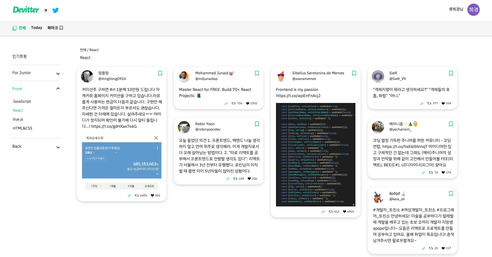
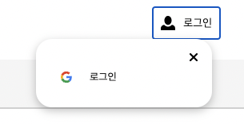
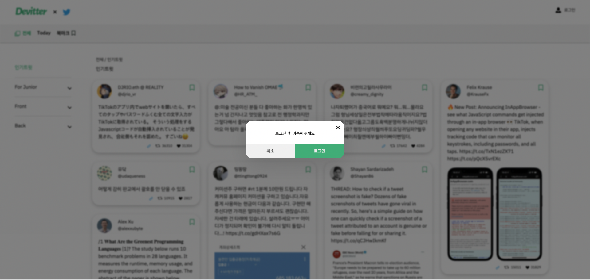
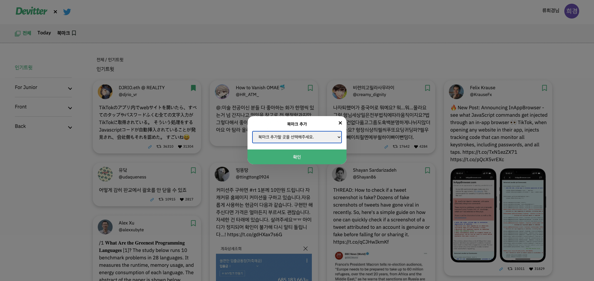
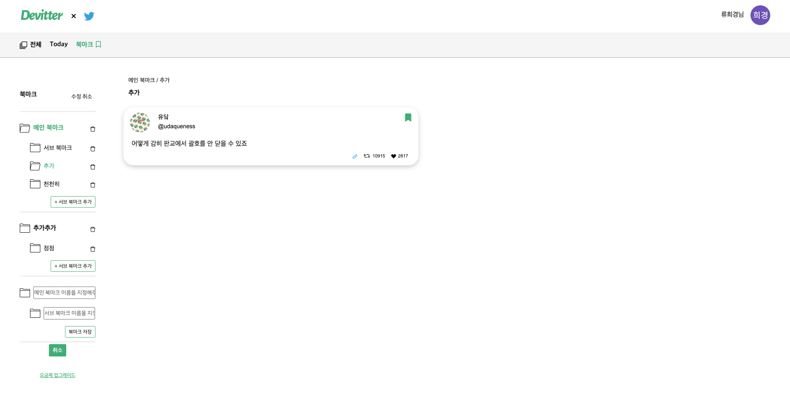
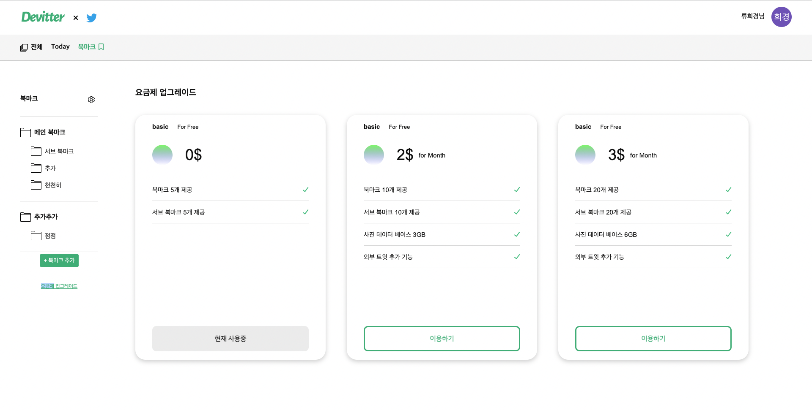

# Overview

## 코드계의 미슐랭, 코슐랭 팀입니다!

with Naver APPETIZER Supporters

### Project

🚩 2022.08 ~

### Team

| **Member** |   Role    |            Github             |
| :--------: | :-------: | :---------------------------: |
| 👩‍💻 류희경  | Front-end | https://github.com/beals1129  |
| 👩‍💻 전은혜  | Front-end | https://github.com/haileyport |
| 👩‍💻 노민하  | Front-end |  https://github.com/MinaRoh   |

---

### 사용 API 기업

해시스크래퍼

> http://www.hashscraper.com/

### API 블로깅 주소

- 👩‍💻 류희경 https://blog.naver.com/beals1129
- 👩‍💻 전은혜 https://blog.naver.com/dol9935
- 👩‍💻 노민하 https://blog.naver.com/rohminha

## DEMO

| 로딩페이지                                                                   | 메인카테고리                                                                      | Today                                                                              |
| ---------------------------------------------------------------------------- | --------------------------------------------------------------------------------- | ---------------------------------------------------------------------------------- |
|      |  |   |
| 로그인                                                                       | 로그인 팝업                                                                       | 북마크 팝업                                                                        |
|    |    |  |
| 북마크                                                                       | 북마크 수정                                                                       | 업그레이드                                                                         |
|  |   |         |
